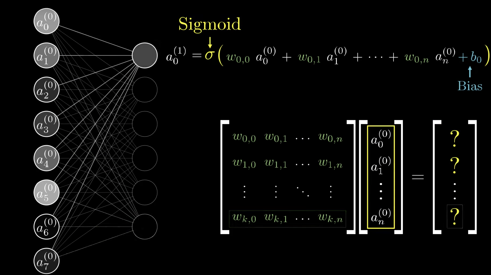
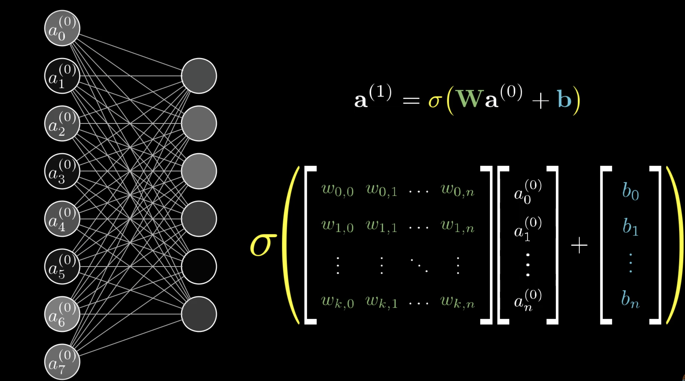

# Machine Learning

## Videos

### Linear Algebra

### Activation Functions

### What is a Neural Network

### Gradient descent, how neural networks learn

### Backpropagation

### Backpropagation Calculus

### Long Short-Term Memory

## Links

### Blogs / Articles
[The Unreasonable Effectiveness of Recurrent Neural Networks Blog Post](http://karpathy.github.io/2015/05/21/rnn-effectiveness/)

[Data Science and Robots Blog](https://brohrer.github.io/blog.html)

[Understanding LSTM Networks](http://colah.github.io/posts/2015-08-Understanding-LSTMs/)

[EEG event classification with convolutional neural networks - A First Pass/Brief Overview](https://www.reddit.com/r/MachineLearning/comments/8mc5jx/p_eeg_event_classification_with_convolutional/)

[Reddit Machine learning](https://www.reddit.com/r/MachineLearning/)

[Closing the Simulation-to-Reality Gap for Deep Robotic Learning](https://ai.googleblog.com/2017/10/closing-simulation-to-reality-gap-for.html)

[pybullet by Alexander Fabisch](http://alexanderfabisch.github.io/pybullet.html)

[Pytransform - lightweight tool to translate between conventions, debug, and visualize](http://alexanderfabisch.github.io/pytransform.html) 

[Alexander Fabisch - Robotics Python](http://alexanderfabisch.github.io/)

### Code

[Torch-rnn Char-rnn update](https://github.com/jcjohnson/torch-rnn)

[Xgboost](https://github.com/dmlc/xgboost)

[Xgboost Node](https://www.npmjs.com/package/xgboost)

### Frameworks & Websites

[TensorFlow](https://js.tensorflow.org/)

[Keras](https://keras.io/)

[Try TensorFlow](https://codepen.io/pen?&editors=1011)

[Colab](https://colab.research.google.com/notebooks/welcome.ipynb#recent=true)

[Kaggle](https://www.kaggle.com/)

[Moniel - Interactive Notation for Computational Graphs ](https://github.com/mlajtos/moniel)

[OpenAI](https://openai.com/)

[OpenAI Github](https://github.com/openai)

[DeepMind - Lab 3D platform for agent-based AI research](https://github.com/deepmind/lab)

[DeepMind - Sonnet](https://github.com/deepmind/sonnet)

[Install Anaconda](https://docs.anaconda.com/anaconda/install/linux)

### Companies

[Baidu](http://research.baidu.com/)

[DeepMind](https://deepmind.com/)

### Books

[Deep learning with python book] (http://proquestcombo.safaribooksonline.com.libdata.lib.ua.edu/book/programming/python/9781617294433)

[Deep learning with python code](https://github.com/fchollet/deep-learning-with-python-notebooks)

[Neural Networks and Deep Learning by Michael Nielsen](http://neuralnetworksanddeeplearning.com/index.html)

[Programming Robots with ROS](http://proquestcombo.safaribooksonline.com.libdata.lib.ua.edu/book/hardware/9781449325480)

[ROS Programming: Building Powerful Robots](http://proquestcombo.safaribooksonline.com.libdata.lib.ua.edu/book/programming/9781788627436)

[ROS Robotics By Example](http://proquestcombo.safaribooksonline.com.libdata.lib.ua.edu/book/hardware/9781782175193)

### Lectures

[Recurrent Neural Network Lecture](https://www.youtube.com/watch?v=iX5V1WpxxkY)

### People

[Andrej Karpathy](https://twitter.com/karpathy)

[Andrew Ng](https://twitter.com/AndrewYNg)

[Geoffrey Hinton](https://scholar.google.co.uk/citations?user=JicYPdAAAAAJ&hl=en)

# Notes

- **Convolutional Neural Network (CNN)** good for **image recognition**
- **Recurrent Neural Networks** and **Long short-term memory** good for **speech recognition**
- Transforming a set of real numbers to normalized values **Logistic functions**, **Logistic Curve** - [Signmoid Function](https://www.quora.com/What-is-the-sigmoid-function-and-what-is-its-use-in-machine-learnings-neural-networks-How-about-the-sigmoid-derivative-function)
- **Weight engineering**? applying weights to areas/components you care about.
- **Cost function** provides feedback to the network
- Learning is minimizing a cost function
- Categorical data is handled using [One hot encoding procedures](https://www.kaggle.com/dansbecker/using-categorical-data-with-one-hot-encoding)

## Activation Function & General Notation

##### Notation for weights and neuron activations 
(Note: Sigmoid approach replaced by RELU activation function)

## BackProp

##### Chain Rule (Calculus) and relevance to cost function in Neural networks (Backprop)(One neuron)
")
 derivatives")
 
##### Chain Rule (Calculus) and relevance to cost function in Neural networks (Backprop)(multi neuron)

")

")

